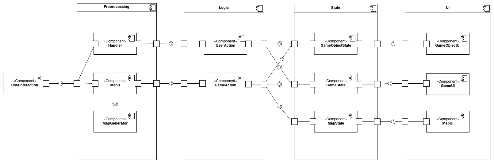

# SD-roguelike

Авторы:
* Анисимова Карина
* Багрянова Екатерина
* Субботина Олеся

## Сведения о системе
**Roguegue** – компьютерная игра с консольной графикой в жанре roguelike.

### Границы системы
* Запускается и работает только в консоли
* Постоянно генерируются новые карты (но есть несколько сохраненных)
* Персонаж управляется с клавиатуры
* Нет сохранений и возможности вернуться к предыдущему сохранению
(при проигрыше игра начинается с начала)
* Графика и действия двумерные
* Игра предоставляет пользователю свободу со множеством вариантов прохождения, а не линейным путем
* Игра имеет один режим и единый набор команд для всех ситуаций (не допускаются дополнительные меню и мини-игры)
* Игра однопользовательская
* Предусмотрен только оффлайн режим
* Есть фиксированный набор команд и отвечающие за них клавиши. В процессе игры они не расширяются и не изменяются.

### Контекст
Игра запускается только в консоли пользователя.

## Architectural drivers

### Технические ограничения
* Поддерживаются операционные системы Linux, MacOS
* Должна использоваться библиотека для консольной графики для выбранного языка программирования и ОС

### Бизнес ограничения
* Сдача проекта в мае 2022
* Использование бесплатных средств разработки
* В команде 3 разработчика

### Качественные характеристики системы
* Расширяемость
* Защищенность от ошибки пользователя
* Тестируемость
* Доступность: возможность использования продукта для достижения цели в заданном контексте широким кругом лиц
* Управляемость: наличие атрибутов, обеспечивающих простое управление и контроль
* Сосуществование: способность продукта совместно функционировать с другими независимыми продуктами

### Функциональные требования
* Игрок управляет только своим персонажем
* Игрок может взаимодействовать с объектами на поле
* Управление заданными на клавиатуре кнопками
* Карта обычно генерируется, но для некоторых уровней грузится из файла
* Приложение работает только в консоли
* Приложение работает в оффлайн режиме

## Роли и случаи использования

### Основные роли
* Игрок
* Программист

### Случаи использования
#### Игрок:
* Игрок хочет играть в игру в стиле roguelike
* Игрок хочет попробовать разных персонажей и разные пути развития, для этого ему нужно иметь высокую свободу действий
* Игрок хочет разнообразия, поэтому уровни должны генерироваться
* Не у всех игроков есть деньги, поэтому в игре не должно быть платных элементов и она не должна сильно нагружать компьютер игрока
#### Программист:
* После релиза игры сторонний программист хочет доработать или изменить игру, для этого ему важно иметь качественное описание проекта
* Программист хочет изменить только конкретную часть игры, архитектура должна позволять сделать это легко
* Программист хочет тестировать свой код, для этого нужны простые и понятно разбитые по модулям тесты

### Описание типичного пользователя

  

  
Михаил, 30 лет, женат, двое детей. Работает системным администратором. Любит играть в компьютерные игры и пробовать новое. 
Его основная операционная система - Linux, поэтому он предпочитает консольные игры. После тяжелого рабочего дня и игр с детьми
Михаил устает и хочет расслабиться, играя в простые компьютерные игры.

## Композиция

  

  

Используем слоистую архитектуру. 
Выделили 5 слоев:
1) UserInteraction - слой для получения сигналов от пользователя
2) Preprocessing - слой для обработки сигналов пользователя и инициализации игры
3) Logic - слой для обработки логики игры
4) State - слой для хранения состояния игры
5) UI - слой для отображения игры

#### UserInteraction
Ждет ввод с клавиатуры, в зависимости от текущего этапа игры (вход в игру/ действующая игра) 
передает сигнал в Menu или Handler

#### Menu
Обрабатывает входные данные для игры, 
при необходимости вызывает MapGenerator или получает карту из сохраненных, 
передает необходимые данные в GameAction

#### Handler
Обрабатывает сигнал пользователя, проверяет его на корректность, передает его в UserAction

#### MapGenerator
Генерирует карту, возвращает ее в Menu

#### UserAction
Преобразовывает полученные данные в действие (передвижение, подбор вещей, удар), 
в зависимости от которого изменяет необходимые State: GameObjectState, GameState

#### GameAction
Получает необходимые для инициализации игры данные,
изменяет необходимые State: GameObjectState, GameState, MapState

#### GameObjectState
Хранит состояние объекта игры (сила удара, здоровье), 
в зависимости от состояния меняется GameObjectUI. От него будут наследоваться состояния объектов игры (сам персонаж, артефакты, монстры)

#### GameState
Хранит состояние игры (score, isFinished), в зависимости от состояния меняется GameUI

#### MapState
Хранит состояние карты, в зависимости от состояния меняется MapUI

#### GameObjectUI
Отображает объект игры. От него будут наследоваться отображения объектов игры (сам персонаж, артефакты, монстры)

#### GameUI
Отображает главное окно

#### MapUI
Отображает карту игры

### Диаграмма последовательностей

  

  

### Диаграмма конечных автоматов

  

  
