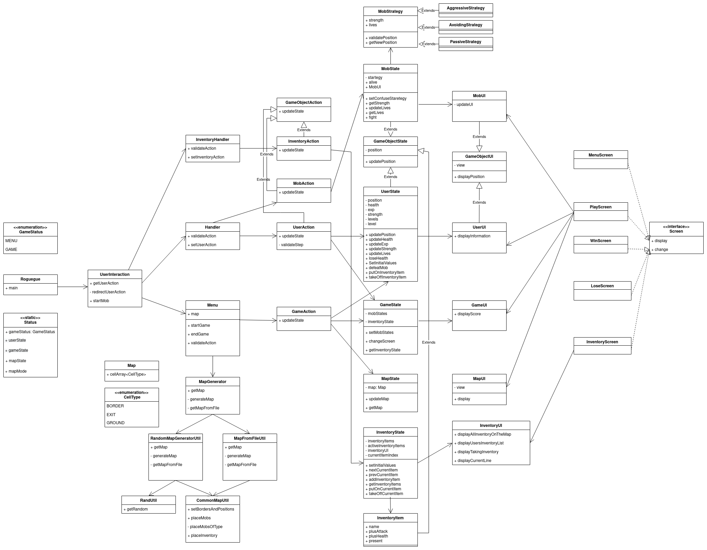
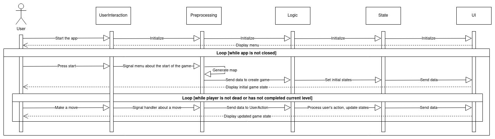
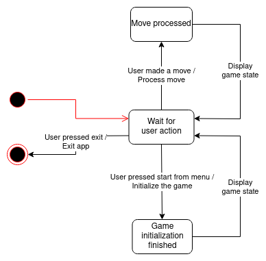

# SD-roguelike

Команда:
* Анисимова Карина
* Багрянова Екатерина
* Субботина Олеся

### Запуск приложения:
Из консоли - из корня ввести команды:

`./gradlew assemble`

` java -jar build/libs/SD-roguelike-1.0-SNAPSHOT.jar`

Из IDE - запуском таски `Roguegue`

Запуск тестов:
Из консоли - `./gradlew test`

! Использует java 17

## Сведения о системе
**Roguegue** – компьютерная двумерная игра с консольной графикой в жанре roguelike.
Игра предоставляет пользователю свободу действий со множеством вариантов прохождения, а не линейным путем.

### Границы системы
* Запускается и работает только в консоли
* Постоянно генерируются новые карты (но есть несколько сохраненных)
* Персонаж управляется с клавиатуры
* Нет сохранений и возможности вернуться к предыдущему сохранению
(при проигрыше игра начинается с начала)
* Графика и действия двумерные
* Игра предоставляет пользователю свободу со множеством вариантов прохождения, а не линейным путем
* Игра имеет один режим и единый набор команд для всех ситуаций (не допускаются дополнительные меню и мини-игры)
* Игра однопользовательская
* Предусмотрен только оффлайн режим
* Есть фиксированный набор команд и отвечающие за них клавиши. В процессе игры они не расширяются и не изменяются.

### Контекст
Игра запускается только в консоли пользователя.

## Architectural drivers

### Технические ограничения
* Поддерживаются операционные системы Linux, MacOS
* Должна использоваться библиотека для консольной графики для выбранного языка программирования и ОС

### Бизнес ограничения
* Сдача проекта в мае 2022
* Использование бесплатных средств разработки
* В команде 3 разработчика
* Не у всех игроков есть деньги, поэтому в игре не должно быть платных элементов и она не должна сильно нагружать компьютер игрока

### Качественные характеристики системы
* Расширяемость
* Защищенность от ошибки пользователя
* Тестируемость
* Доступность: возможность использования продукта для достижения цели в заданном контексте широким кругом лиц
* Управляемость: наличие атрибутов, обеспечивающих простое управление и контроль
* Сосуществование: способность продукта совместно функционировать с другими независимыми продуктами

### Функциональные требования
* Игрок управляет только своим персонажем
* Игрок может взаимодействовать с объектами на поле
* Управление заданными на клавиатуре кнопками
* Карта обычно генерируется (для разнообразия процесса игры), но для некоторых уровней грузится из файла
* Приложение работает только в консоли
* Приложение работает в оффлайн режиме
* Нет сохранений и возможности вернуться к предыдущему сохранению
  (при проигрыше игра начинается с начала)
* Высокая свобода действий игрока - возможность попробовать разных персонажей и разные пути развития

### Технологии
* Разработка будет вестись на языке Java.
* TODO: описать библиотеки

## Роли и случаи использования

### Основные роли
* Игрок
* Программист

### Случаи использования
#### Игрок:
* Игрок хочет играть в игру в стиле roguelike и получать удовольствие
#### Программист:
* После релиза игры сторонний программист хочет доработать или изменить игру, для этого ему важно иметь качественное описание проекта
* Программист хочет изменить только конкретную часть игры, архитектура должна позволять сделать это легко
* Программист хочет тестировать свой код, для этого нужны простые и понятно разбитые по модулям тесты

### Описание типичного пользователя

  

  
Михаил, 30 лет, женат, двое детей. Работает системным администратором. Любит играть в компьютерные игры и пробовать новое. 
Его основная операционная система - Linux, поэтому он предпочитает консольные игры. После тяжелого рабочего дня и игр с детьми
Михаил устает и хочет расслабиться, играя в простые компьютерные игры.

## Композиция

### Диаграмма компонентов

  
.png)
  

### Диаграмма классов

  

  

Используем слоистую архитектуру. 
Выделили 5 слоев:
1) UserInteraction - слой для получения сигналов от пользователя
2) Preprocessing - слой для обработки сигналов пользователя и инициализации игры
3) Logic - слой для обработки логики игры
4) State - слой для хранения состояния игры
5) UI - слой для отображения игры

#### Roguegue
Основной класс. Из него происходит запуск игры. 
При запуске пользователь может передать режим карты: по дефолту карта генерируется, 
но пользователь может указать режим -f, тогда карта будет выбираться из сохраненных.

В этом классе запускается основной цикл игры. 
Внутри него запускается цикл ходов на одном уровне.
Также создается экземпляр класса UserInteraction и вызывается его метод getUserAction.

#### UserInteraction
Метод getUserAction ждет ввод с клавиатуры, в зависимости от текущего этапа игры (вход в игру / действующая игра).
И с помощью redirectUserAction передает сигнал в Menu или Handler.

#### Menu
Обращается к MapGenerator, чтобы получить карту, валидирует действие пользователя (допустимая ли кнопка)
и вызывает метод updateState у GameAction.

#### Handler
Обрабатывает сигнал пользователя, проверяет его на корректность.
В методы setUserAction создает экземпляр класса UserAction и запускает его метод updateState.

#### MapGenerator
Возвращает карту из метода getMap. Получает ее в методах getMapFromFile и generateMap в зависимости от mapMode.
Эти методы используют Util-классы CommonMapUtil, MapFromFileUtil, RandomMapGeneratorUtil.

###### RandomMapGeneratorUtil
Генерирует карту рандомно так, что из любой комнаты есть путь в любую другую комнату.
###### MapFromFileUtil
Берет карту из файла и переводит ее в вид, соответствующий классу Map.
###### CommonMapUtil
Выставляет границы карты, генерирует исходную позицию пользователя и клетку выхода, а также генерирует
объекты инвентаря и мобов на карте.

#### Map
Представление карты в виде двумерного массива клеток Cell.

#### Cell
Клетка карты, которая имеет несколько типов (BORDER, EXIT, GROUND).

#### GameObjectAction
Интерфейс, который реализуют классы Action других объектов. 
Преобразовывает полученные данные в одно из доступных действий (передвижение, подбор вещей, удар).

#### UserAction
Метод updateState изменяет необходимые State: GameObjectState, GameState и валидирует ход игрока.

#### GameAction
Получает необходимые для инициализации игры данные.
Метод updateState изменяет необходимые State: GameObjectState, GameState, MapState.

#### GameObjectState
Хранит позицию и обновляет ее методом updatePosition.
В зависимости от состояния меняется GameObjectUI. От него будут наследоваться состояния объектов игры (сам персонаж, артефакты, монстры).

#### UserState
Хранит позицию, здоровье, силу, опыт, количество жизней и уровень игрока, обновляет их.
Обрабатывает потерю здоровья пользователя, переход на новые уровни и победу над мобом (увеличение опыта)

#### MobState
Функция fight обрабатывает момент драки. Бьет тот, у кого больше силы (юзер или моб), при ударе по юзеру отнимается
определенное количество здоровья, могут уменьшиться жизни. При ударе по мобу у моба уменьшается жизнь на 1.

Также этот класс имплементирует интерфейс Cloneable (реализует метод clone), это используется в методе replicate.
С помощью этого метода может создаваться копия моба в рандомный момент времени.

#### MobStrategy
Базовый класс для стратегии моба.
Метод validatePosition проверяет позицию на корректность, метод getNewPosition просто возвращает текущую позицию моба.

### StrategyDecorator
Класс, который наследуется от MobStrategy и умеет декорировать стратегию, то есть изменять ее, возможно временно.
В себе хранит декорируемую стратегию и переопределяет главный метод GetNewPosition.

### ConfuseStrategyDecorator
Конкретный декоратор (наследуется от StrategyDecorator), который конфузит моба на 10 шагов.
В этот момент моб двигается в рандомном направлении. После меняет стратегию на изначальную до конфуза.

#### AreaHoldingStrategy
Стратегия, мобу присваивается квадрат 4 на 4 (инициализируется позицией моба, на которой он стоял в момент получения этой стратегии) и он может делать шаги только в этом пространстве.

#### StrategyState
Абстрактный класс - базовый для состояний.
Методы:
* validatePosition валидирует позицию моба
* getNewPosition возвращает текущую позицию моба
* updateStrategy дает мобу новую стратегию в зависимости от условий, переопределяется каждым состоянием
* setConfuse - конфузит моба
* tryRemoveStrategyDecorator - убирает декоратор с конфузией
* checkDistance - метод для проверки расстояния между юзером и мобов

#### PassiveStrategyState
Состояние, updateStrategy: если моб находится на очень большом расстоянии от игрока - его стратегия переключается на пассивную.

#### PatrolStrategyState
Состояние, updateStrategy: если моб находится на среднем расстоянии от игрока - его стратегия переключается на патрулирующую территорию (area holding)

#### GameState
Хранит состояние игры (score), в зависимости от состояния меняется GameUI.

#### MapState
Хранит состояние карты, в зависимости от состояния меняется MapUI.

#### UICommand
Интерфейс для команд с методом execute. Команды (классы, которые имплементируют этот интерфейс) будут вызываться в бизнес логике,
а взаимодействие с UI осуществляться только внутри команды.

Классы, имплементирующие этот интерфейс:
* ChangeScreenCommand – в методе execute нужная логика, чтобы поменять экран
* DisplayCurrentLineCommand – отдает отображение текущей линии в списке инвентаря на аутсорс InventoryUI
* DisplayInformationCommand – отдает на аутсорс UserUI отображение информации о пользователе (здоровье и т.д)
* DisplayMapCommand – команда для отображения карты 
* DisplayNewObjectPosition – команда для отображения корректной карты после передвижения объекта
* DisplayScreenCommand - команда, при выполнении которой отображается все содержимое нужного экрана
* DisplayTakingInventory - команда, которая отдает на аутсорс InventoryUI отображение поднятия инвентаря

#### GameObjectUI
Отображает объект игры на поле. От него будут наследоваться отображения объектов игры (сам персонаж, артефакты, монстры).

#### UserUI
Наследуется от GameObjectUI, отображает игрока.
Юзер отображается символом `!`.

#### MobUI
Наследуется от GameObjectUI, отображает мобов. 
В зависимости от стратегии отличается их представление на экране.
Мобы отображаются маленькими латинскими буквами (по первой букве названия стратегии).

#### GameUI
Отображает информацию об игре. 

#### MapUI
Отображает карту игры. Представление клетки зависит от типа ее покрытия (CellType).
Выход отображается символом `+`.

#### InventoryUI
Отображает элементы инвентаря на карте и их взятие юзером. 
Также список инвентаря пользователя в отдельном окне или передвижение по нему.

### Screen
Интерфейс для экранов, которые видит пользователь. Его будут имплементировать все экраны. 

Методы:
* display – отображает все начальное содержимое экрана
* change – меняет экран на другой и возвращает его, если выполняются нужные условия. Иначе возвращает текущий экран.

Классы, имплементирующие этот интерфейс:
* MenuScreen – меню, которое пользователь видит перед тем, как начать игру
* PlayScreen – экран для игрового процесса. На нем пользователь видит карту, игрока, мобов и т.д. А также свои характеристики.
* LoseScreen – экран, на котором отображается сообщение о поражении (появляется после PlayScreen).
* WinScreen – экран, на котором отображается сообщение о выигрыше (появляется после PlayScreen).
* InventoryScreen – экран, на котором выводится список инвентаря пользователя. В списке можно выбрать нужный инвентарь с помощью клавиш. Экран появляется во время процесса игры. 

### Диаграмма последовательностей

  

  

### Диаграмма конечных автоматов

  

  

## Rationale
Для разработки был выбран язык программирования Java, как наиболее комфортный для нас.
Также для Java есть все необходимые библиотеки и она предоставляет достаточный функционал для выполнения задач.

Мы ознакомились с ресурсами и выбрали слоистую архитектуру, как одну из самых базовых и используемую для реализации игр.

